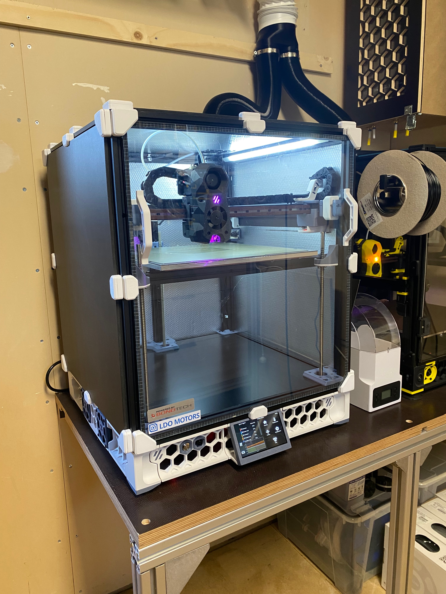

# Voron VT.572

Configuration, Features & Documentation of my Voron Trident VT.572

## Main Components

### Electronics
- A/B Motors: [LDO Motors 42STH48-2504AC](http://ldomotors.com/products/show/42mm-hybrid-stepper-series)
- Z Motors: [LDO Motors 42STH40-1684L300E(VRN)](http://ldomotors.com/products/show/42mm-hybrid-stepper-series)
- MCU: [Spider V1.1 (w/TMC2209)](https://www.fysetc.com/products/pre-sale-fysetc-spider-v1-0-motherboard-32bit-controller-board-tmc2208-tmc2209-3d-printer-part-replace-skr-v1-3-for-voron?variant=39404109201583)
- PSU: [Mean Well UHP-350-24](https://www.meanwell.com/productPdf.aspx?i=830)
- Host: [Raspberry Pi 4 Model B 4GB](https://www.raspberrypi.com/products/raspberry-pi-4-model-b/?variant=raspberry-pi-4-model-b-4gb)
- Display: [Waveshare 4.3 inch 800x400](https://www.waveshare.com/4.3inch-dsi-lcd.htm)
- Camera: [Waveshare RPi Camera I Fisheye](https://www.waveshare.com/rpi-camera-i.htm)
### Toolhead
- Hotend: [Phaetus Dragon Highflow]()
- Hotend Fan: [Pabst 414FH](https://www.ebmpapst.com/content/dam/ebm-papst/media/catalogs/products/Catalog_Compactfans_US_en.pdf)
- Parts Fan: [Delta BFB0524H-R00](https://www.delta-fan.com/products/BFB0524H-R00.html) 
### Mechanics & Frame
- Frame: [LDO Trident 300](http://ldomotors.com)
- X Linear Rail: [CPC MR12 ML](http://www.chieftek.com/)
- Y & Z Rails: [Robotdigg GCr15 MGN9H](https://www.robotdigg.com/product/246/GCr15-MGN9-Linear-Rail-with-MGN9H-or-MGN9C-Carriage)
- Motion Components: [POWGE Trident Motion Set](https://www.aliexpress.com/item/1005003310450958.html?spm=a2g0o.productlist.0.0.5dcd270exzqykb&algo_pvid=1b406ae2-0613-43e3-9b16-6f8c466a94e0&algo_exp_id=1b406ae2-0613-43e3-9b16-6f8c466a94e0-0&pdp_ext_f=%7B%22sku_id%22%3A%2212000025140029654%22%7D&pdp_npi=1%40dis%7CSEK%7C%7C899.84%7C%7C%7C%7C%7C%402101e9d216515087101807293eb2cb%7C12000025140029654%7Csea)
### Print bed
- Buildplate: Oversized EN AW-5083 plate (320mmx320mmx8mm)
- Heater: [Keenovo 750W 300mm x 300mm](https://keenovo.store/collections/frontpage/products/keenovo-square-silicone-heater-3d-printer-build-plate-heatbed-heating-pad?variant=8324021551159)
- Flexplate(s): [Energetic Flexplates](https://energetic3d.aliexpress.com/store/4542004)
## Modifications & Extras
### Probe
- Probe: [Euclid Probe](https://euclidprobe.github.io)
- Deployment: Custom native X Carriage (Link to repository after Stealthburner launch)
### Toolhead
- Toolhead & Cooling: [Stealthburner beta #112](https://github.com/VoronDesign/Voron-Afterburner/tree/sb-beta)
- Extruder: [Bondtech LGX](https://www.bondtech.se/product/lgx-large-gears-extruder/)
### Cable Management: 
- Toolhead: Custom Molex Microfit Panel Mounts for Bondtech LGX (Link to repository after Stealthburner launch)
- Buildplate: Custom Molex Microfit Panel Mounts (Link to repository soon)
### Panels
- Panels: Expanded PVC Foam Panels (top & sides)
- Heat Reflection:
### Exhaust Solution:
- Exhaust Solution: Custom carbon filtered top panel outlet with connection to central ventilation (Link to repository soon)
### Caselights:
- LED Strips: 24V Cold White LED Strips
- Mounts: [45° aluminum profiles with diffuser](https://lumentec.eu/epages/e4360bea-6b9b-4161-a115-a88bb0233b45.sf/de_DE/?ObjectPath=/Shops/e4360bea-6b9b-4161-a115-a88bb0233b45/Products/5902650024410) with custom 2020 extrusion mounts
